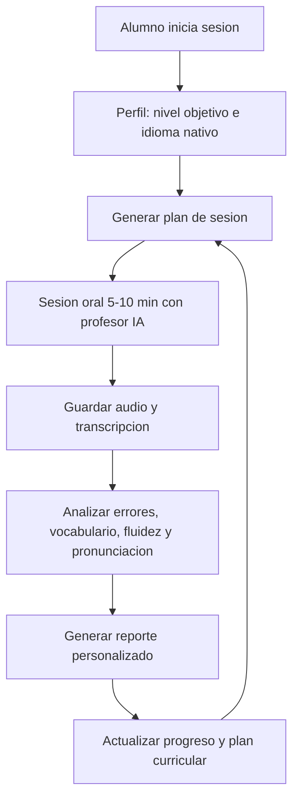

# PRD — Habla

## 1. Introduccion

Habla es un sistema de practica de ingles conversacional con IA para estudiantes que quieren mejorar de forma continua, medible y personalizada. La propuesta combina sesiones cortas de conversacion oral con un pipeline posterior de transcripcion, analisis y planificacion adaptativa.

El problema principal es que muchas herramientas de practica conversacional ofrecen conversacion abierta, pero no convierten cada interaccion en aprendizaje estructurado. El alumno habla, recibe feedback puntual y vuelve a empezar casi desde cero. Habla busca cerrar ese bucle: cada sesion deja evidencia, metricas y una decision sobre que practicar despues.

## 2. Objetivos

### Objetivo de producto

Construir una aplicacion E2E que permita a un alumno practicar ingles por voz con un profesor IA y recibir un reporte personalizado que alimente automaticamente la siguiente sesion.

### Objetivos de la Entrega 1

- Definir el producto, su flujo principal y su alcance MVP.
- Documentar arquitectura, modelo de datos e integraciones principales.
- Especificar historias de usuario con criterios de aceptacion verificables.
- Preparar una base documental suficientemente clara para que las entregas 2 y final puedan implementarse con asistencia de IA.

### Objetivos del MVP

- Reducir la friccion de planificar practica oral.
- Dar feedback util despues de cada sesion.
- Mantener memoria longitudinal del progreso del alumno.
- Ajustar automaticamente la siguiente sesion a los errores y huecos detectados.

## 3. Usuarios y stakeholders

### Usuario principal

Alumno adulto de ingles, nivel A2-B2, que ya entiende conceptos basicos pero necesita practicar conversacion real de forma frecuente. Tiene poco tiempo, valora sesiones breves y quiere saber si mejora.

### Stakeholders

- Alumno: quiere practicar y ver progreso.
- Mentor/evaluador AI4Devs: evalua claridad de la documentacion, uso de IA, ejecucion tecnica y calidad del MVP.
- Desarrollador del proyecto: necesita una especificacion accionable para implementar con agentes de coding.
- Futuro profesor/tutor humano: podria usar reportes como apoyo para clases reales.

## 4. Propuesta de valor

Habla no se limita a mantener una conversacion. Convierte cada sesion en datos de aprendizaje:

- Transcripcion completa y consultable.
- Errores gramaticales y de vocabulario con explicacion.
- Senales de fluidez como pausas, hesitaciones y velocidad.
- Senales de pronunciacion basadas en confianza palabra a palabra.
- Reporte bilingue con prioridades concretas.
- Plan de la siguiente sesion basado en evidencia.

## 5. Flujo E2E del MVP

## 6. Funcionalidades

### Must-have

- Registro y login del alumno.
- Perfil inicial con nombre, idioma nativo y nivel objetivo CEFR.
- Preparacion automatica de sesion.
- Conversacion oral con profesor IA.
- Persistencia de sesion, audio, prompt usado y estado.
- Transcripcion completa de la sesion.
- Analisis post-sesion de gramatica, vocabulario, fluidez y pronunciacion.
- Reporte con fortalezas, puntos de mejora, vocabulario nuevo y score global.
- Dashboard basico de progreso.
- Plan adaptativo para la siguiente sesion.

### Should-have

- Drill de pronunciacion para repetir frases dificiles.
- Exportar reporte a PDF.
- Comparativa entre proveedor hosted y motores full-duplex como PersonaPlex 7B local como investigacion.

## 7. Experiencia de usuario

La aplicacion debe sentirse como una herramienta de aprendizaje tranquila y directa. La primera pantalla autenticada debe llevar al alumno al siguiente paso natural: empezar la proxima sesion o revisar el ultimo reporte.

Principios UX:

- Sesiones cortas y enfocadas.
- Sin configuraciones complejas antes de practicar.
- Ingles durante la conversacion; feedback bilingue despues.
- El reporte debe priorizar accion sobre explicacion larga.
- El dashboard debe mostrar tendencias, no solo datos aislados.

## 8. Requisitos funcionales

| ID | Requisito |
|---|---|
| RF-01 | El alumno puede autenticarse y mantener su progreso asociado a su cuenta. |
| RF-02 | El sistema genera un prompt de sesion segun perfil, nivel y plan curricular. |
| RF-03 | El alumno puede iniciar y finalizar una sesion oral desde el navegador. |
| RF-04 | El backend registra la sesion y sus cambios de estado. |
| RF-05 | El sistema almacena transcripcion palabra a palabra con marcas temporales. |
| RF-06 | El sistema detecta errores y produce correcciones explicadas. |
| RF-07 | El sistema calcula metricas de fluidez, gramatica, vocabulario y pronunciacion. |
| RF-08 | El alumno puede consultar reportes anteriores. |
| RF-09 | El sistema genera un plan para la siguiente sesion. |

## 9. Requisitos no funcionales

| Categoria | Requisito |
|---|---|
| Latencia | La primera respuesta del profesor IA debe sonar en menos de 3 segundos en condiciones normales. |
| Rendimiento | El reporte debe estar disponible en menos de 60 segundos tras terminar una sesion MVP. |
| Seguridad | Las claves de proveedores IA no deben exponerse al frontend. |
| Privacidad | Audio y transcripciones se asocian al usuario autenticado y se protegen con politicas de acceso. |
| Observabilidad | Cada sesion debe tener trazas suficientes para depurar latencia, coste y calidad del analisis. |
| Mantenibilidad | Prompts de generacion, analisis y planificacion deben versionarse. |

## 10. KPIs

- Retencion: porcentaje de alumnos que completan al menos 3 sesiones en su primera semana.
- Mejora medible: variacion promedio entre sesion 1 y sesion 10 en `progress_snapshot`.
- Fluidez: latencia mediana de primera respuesta inferior a 2 segundos.
- Calidad del analisis: porcentaje de errores detectados validados manualmente como correctos.
- Engagement: duracion mediana de sesion dentro del rango objetivo de 5 a 10 minutos.

## 11. Non-goals

- No se implementa app movil nativa en el MVP.
- No se implementan clases grupales.
- No se implementa gamificacion completa tipo streaks, vidas o rankings.
- No se soportan idiomas de aprendizaje distintos al ingles.
- No se personaliza la voz del profesor en el MVP.
- No se requiere modo offline.
- No se bloquea el MVP por el experimento con modelo local PersonaPlex 7B.

## 12. Supuestos

- El usuario tiene microfono disponible en navegador.
- Se usara un proveedor hosted para voz en el MVP.
- Supabase cubre autenticacion, base de datos y potencialmente storage en la primera version.
- La comparativa entre Gemini Live API y OpenAI Realtime API se resolvera antes de la Entrega 2 con una prueba corta de latencia, coste y calidad.
- La URL publica prevista sera `https://habla.tuklon.ai`.
