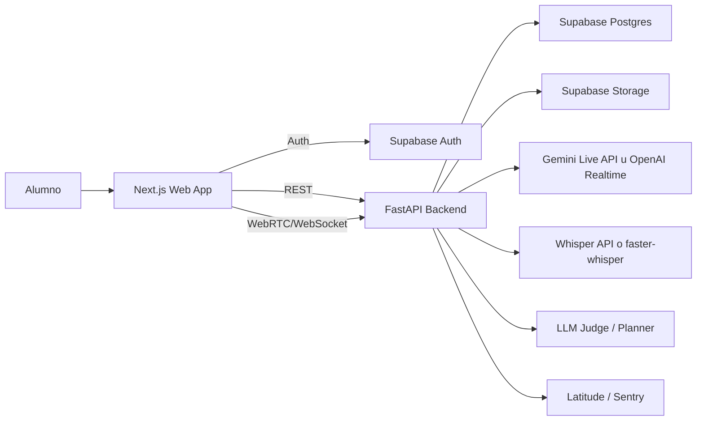
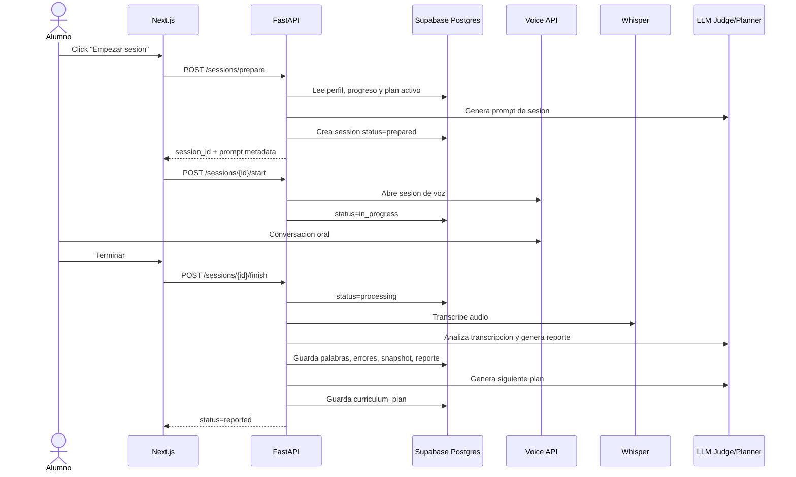
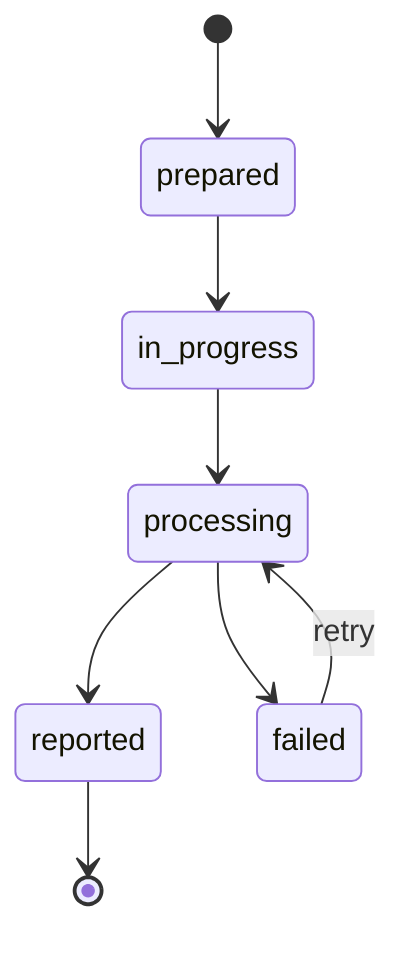

# Arquitectura tecnica

## 1. Vision general

Habla se organiza como una aplicacion web con frontend Next.js, backend FastAPI y persistencia en Supabase Postgres. El backend actua como orquestador entre el navegador, la base de datos y los proveedores de IA.

La decision principal del MVP es mantener el producto desplegable y realista: usar proveedor hosted para voz-a-voz y reservar PersonaPlex 7B local como linea de investigacion paralela, no como dependencia critica.

## 2. Componentes

### Frontend — Next.js

Responsabilidades:

- Gestionar autenticacion de usuario con Supabase Auth.
- Mostrar pantallas de inicio, sesion, reporte, historial y progreso.
- Capturar audio del microfono del alumno.
- Mostrar estado de la sesion en tiempo real.
- Consumir endpoints REST para reportes, progreso y planes.
- Mantener una experiencia responsive.

Pantallas iniciales:

- `/login`: acceso por magic link u OAuth.
- `/onboarding`: nombre, idioma nativo y nivel objetivo.
- `/dashboard`: proxima sesion, ultimos reportes y progreso resumido.
- `/session/new`: preparacion e inicio de sesion.
- `/session/[id]`: sesion en curso o detalle de reporte.
- `/progress`: graficas y errores recurrentes.

### Backend — FastAPI

Responsabilidades:

- Validar token de usuario.
- Crear y actualizar sesiones.
- Generar prompts de conversacion.
- Orquestar conexion con proveedor de voz.
- Guardar audio y transcripciones.
- Ejecutar pipeline de analisis post-sesion.
- Generar reportes y planes curriculares.
- Exponer endpoints para dashboard y progreso.

Servicios internos propuestos:

| Servicio | Responsabilidad |
|---|---|
| `SessionOrchestrator` | Crear sesion, controlar estados y coordinar voz. |
| `PromptBuilder` | Construir prompt de profesor IA segun nivel y plan. |
| `AnalysisPipeline` | Coordinar transcripcion, errores, scores y reporte. |
| `CurriculumPlanner` | Generar el foco de la siguiente sesion. |
| `ProgressService` | Consolidar metricas longitudinales. |
| `ProviderGateway` | Encapsular Gemini/OpenAI/Whisper para evitar acoplamiento. |

### Supabase

Responsabilidades:

- Autenticacion.
- Persistencia relacional.
- Politicas de acceso por usuario.
- Storage de audio o artefactos asociados a sesiones.

### Proveedores IA

| Proveedor | Uso |
|---|---|
| Gemini Live API u OpenAI Realtime API | Conversacion de voz de baja latencia. |
| Whisper API o faster-whisper | Transcripcion con marcas temporales y confianza. |
| LLM de analisis | Correcciones, explicaciones, resumen y plan adaptativo. |
| Latitude | Trazas de prompts, respuestas, coste y calidad. |

## 3. Flujo tecnico de una sesion

## 4. API inicial

| Metodo | Ruta | Uso |
|---|---|---|
| `GET` | `/me` | Devuelve perfil autenticado. |
| `POST` | `/profile` | Crea o actualiza perfil inicial. |
| `POST` | `/sessions/prepare` | Genera prompt y crea sesion preparada. |
| `POST` | `/sessions/{id}/start` | Marca sesion como iniciada y prepara canal de voz. |
| `POST` | `/sessions/{id}/finish` | Cierra sesion y dispara analisis. |
| `GET` | `/sessions/{id}` | Devuelve detalle, estado y reporte si existe. |
| `GET` | `/sessions` | Lista historial de sesiones. |
| `GET` | `/progress` | Devuelve metricas longitudinales. |
| `GET` | `/curriculum/next` | Devuelve foco de la proxima sesion. |

## 5. Estados de sesion

| Estado | Significado |
|---|---|
| `prepared` | Prompt generado; aun no hay conversacion. |
| `in_progress` | Conversacion activa. |
| `processing` | Sesion finalizada; analisis pendiente o en ejecucion. |
| `reported` | Reporte y plan siguiente disponibles. |
| `failed` | Error recuperable durante transcripcion o analisis. |

## 6. Seguridad y privacidad

- El frontend nunca recibe claves de proveedores IA.
- Todas las rutas privadas validan token Supabase.
- Las queries de datos filtran siempre por `user_id`.
- Supabase RLS debe impedir acceso cruzado a perfiles, sesiones y reportes.
- Audio y transcripciones se consideran datos sensibles.
- Los logs no deben guardar audio completo ni transcripciones completas salvo trazas controladas.
- Los prompts registrados en Latitude deben anonimizar o reducir datos personales cuando sea posible.

## 7. Observabilidad

Eventos y metricas minimas:

- Latencia de preparacion de sesion.
- Latencia hasta primera respuesta de voz.
- Duracion total de sesion.
- Coste por sesion.
- Tiempo de transcripcion.
- Tiempo de analisis.
- Errores por proveedor.
- Version de prompt usada.
- Score de confianza del reporte cuando aplique.

## 8. Despliegue

| Componente | Plataforma propuesta |
|---|---|
| Frontend | Vercel |
| Backend | Railway o Fly.io |
| DB/Auth/Storage | Supabase |
| Dominio | `habla.tuklon.ai` |
| CI | GitHub Actions |

Pipeline minimo:

1. Pull request ejecuta lint, typecheck y tests.
2. Vercel crea preview del frontend.
3. Backend ejecuta tests unitarios y de integracion.
4. Main despliega a produccion/staging.
5. Secrets se configuran en Vercel, Railway/Fly y GitHub Actions, no en el repositorio.

## 9. Decision pendiente: proveedor de voz

Antes de implementar la Entrega 2 se debe elegir entre Gemini Live API y OpenAI Realtime API con una prueba de 10 sesiones cortas o simuladas.

Criterios:

- Latencia de primera respuesta.
- Calidad de turn-taking.
- Coste estimado por sesion.
- Facilidad de integracion WebRTC/WebSocket.
- Calidad de voz para aprendizaje.
- Capacidad de recuperar transcripcion util.
