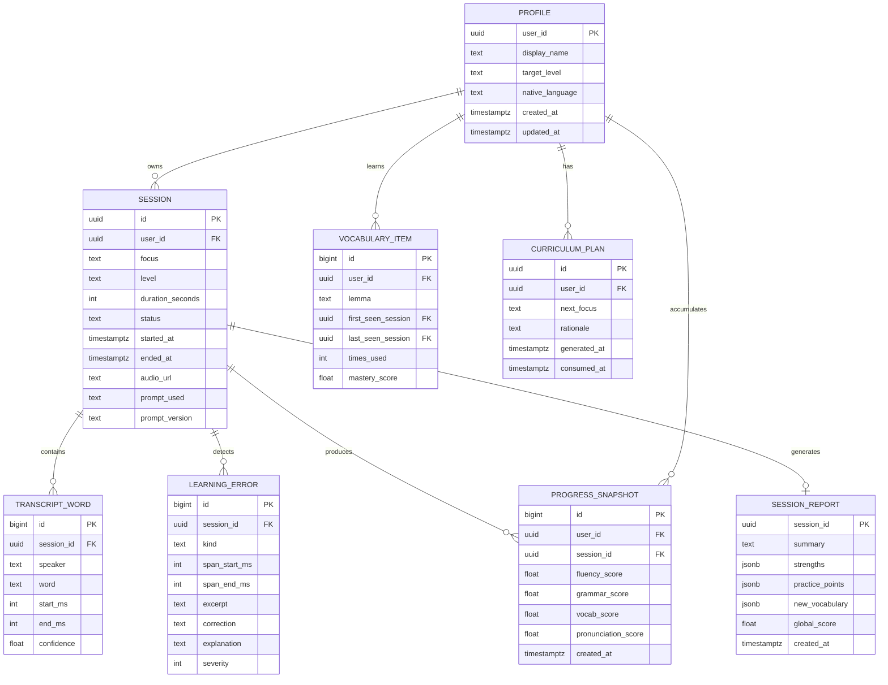

# Modelo de datos

## 1. Objetivo del modelo

El modelo debe capturar el bucle de aprendizaje completo: perfil del alumno, sesiones, transcripciones, errores, vocabulario, metricas de progreso y planes curriculares. La informacion no se limita a una sesion aislada; debe permitir personalizacion longitudinal.

## 2. Entidades principales



## 3. Esquema SQL inicial

```sql
create table profile (
  user_id uuid primary key references auth.users(id) on delete cascade,
  display_name text not null,
  target_level text not null check (target_level in ('A1','A2','B1','B2','C1','C2')),
  native_language text not null,
  created_at timestamptz not null default now(),
  updated_at timestamptz not null default now()
);

create table session (
  id uuid primary key default gen_random_uuid(),
  user_id uuid not null references profile(user_id) on delete cascade,
  focus text not null,
  level text not null check (level in ('A1','A2','B1','B2','C1','C2')),
  duration_seconds int,
  status text not null check (status in ('prepared','in_progress','processing','reported','failed')),
  started_at timestamptz,
  ended_at timestamptz,
  audio_url text,
  prompt_used text not null,
  prompt_version text not null,
  created_at timestamptz not null default now(),
  updated_at timestamptz not null default now()
);

create table transcript_word (
  id bigserial primary key,
  session_id uuid not null references session(id) on delete cascade,
  speaker text not null check (speaker in ('user','teacher')),
  word text not null,
  start_ms int not null,
  end_ms int not null,
  confidence float check (confidence >= 0 and confidence <= 1)
);

create table learning_error (
  id bigserial primary key,
  session_id uuid not null references session(id) on delete cascade,
  kind text not null check (kind in ('grammar','pronunciation','vocab','fluency')),
  span_start_ms int,
  span_end_ms int,
  excerpt text not null,
  correction text,
  explanation text not null,
  severity int not null check (severity between 1 and 3),
  created_at timestamptz not null default now()
);

create table vocabulary_item (
  id bigserial primary key,
  user_id uuid not null references profile(user_id) on delete cascade,
  lemma text not null,
  first_seen_session uuid references session(id) on delete set null,
  last_seen_session uuid references session(id) on delete set null,
  times_used int not null default 1,
  mastery_score float not null default 0 check (mastery_score >= 0 and mastery_score <= 1),
  created_at timestamptz not null default now(),
  updated_at timestamptz not null default now(),
  unique (user_id, lemma)
);

create table progress_snapshot (
  id bigserial primary key,
  user_id uuid not null references profile(user_id) on delete cascade,
  session_id uuid not null references session(id) on delete cascade,
  fluency_score float not null check (fluency_score >= 0 and fluency_score <= 100),
  grammar_score float not null check (grammar_score >= 0 and grammar_score <= 100),
  vocab_score float not null check (vocab_score >= 0 and vocab_score <= 100),
  pronunciation_score float not null check (pronunciation_score >= 0 and pronunciation_score <= 100),
  created_at timestamptz not null default now(),
  unique (session_id)
);

create table curriculum_plan (
  id uuid primary key default gen_random_uuid(),
  user_id uuid not null references profile(user_id) on delete cascade,
  next_focus text not null,
  rationale text not null,
  generated_at timestamptz not null default now(),
  consumed_at timestamptz
);

create table session_report (
  session_id uuid primary key references session(id) on delete cascade,
  summary text not null,
  strengths jsonb not null,
  practice_points jsonb not null,
  new_vocabulary jsonb not null,
  global_score float not null check (global_score >= 0 and global_score <= 100),
  created_at timestamptz not null default now()
);
```

## 4. Indices recomendados

```sql
create index idx_session_user_created on session(user_id, created_at desc);
create index idx_session_status on session(status);
create index idx_transcript_word_session_time on transcript_word(session_id, start_ms);
create index idx_learning_error_session_kind on learning_error(session_id, kind);
create index idx_learning_error_severity on learning_error(session_id, severity desc);
create index idx_vocabulary_user_mastery on vocabulary_item(user_id, mastery_score asc);
create index idx_progress_user_created on progress_snapshot(user_id, created_at desc);
create index idx_curriculum_user_active on curriculum_plan(user_id, generated_at desc) where consumed_at is null;
```

## 5. Reglas de dominio

- Un usuario solo puede consultar sesiones, reportes, errores y vocabulario asociados a su `user_id`.
- Una sesion no puede pasar a `reported` si no existe `session_report`.
- Una sesion `in_progress` debe tener `started_at`.
- Una sesion `reported` debe tener `ended_at`.
- Solo debe existir un plan curricular activo por usuario cuando se prepare una sesion.
- Al preparar una nueva sesion, el plan consumido se marca con `consumed_at`.
- `mastery_score` debe actualizarse con uso, repeticion y antiguedad del vocabulario.

## 6. Politicas RLS iniciales

Supabase debe habilitar Row Level Security en todas las tablas de usuario. Politica base:

```sql
using (auth.uid() = user_id)
```

Para tablas que dependen de `session_id`, la politica debe verificar que la sesion pertenece al usuario autenticado mediante subconsulta a `session`.

## 7. Datos de ejemplo

```json
{
  "profile": {
    "display_name": "Juan Carlos",
    "target_level": "B2",
    "native_language": "Spanish"
  },
  "curriculum_plan": {
    "next_focus": "Past simple irregular verbs in work conversations",
    "rationale": "The last sessions showed repeated mistakes with went, took and made."
  },
  "session_report": {
    "global_score": 74,
    "strengths": ["Clear intent", "Good vocabulary around work routines"],
    "practice_points": ["Past tense consistency", "Pronunciation of worked endings"],
    "new_vocabulary": ["deadline", "handover", "follow-up"]
  }
}
```
